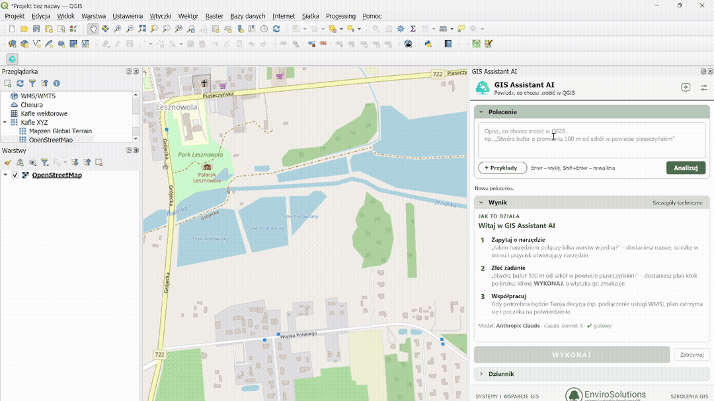

# GIS Assistant AI

## PL
Wtyczka QGIS z asystentem AI. W panelu wtyczki opisujesz językiem naturalnym, co chcesz zrobić w QGIS (np. „Stwórz bufor o promieniu 100 metrów od szkół w powiecie piaseczyńskim”), a wtyczka wskazuje odpowiednie narzędzie albo przygotowuje plan działań krok po kroku i wykonuje go po kliknięciu „WYKONAJ”.

Aktualna wersja: **0.4.3**. Od wersji 0.4 odpowiedzi AI przesyłane są strumieniowo (bez przerywania długich zapytań), asystent korzysta także z algorytmów zainstalowanych wtyczek (np. QuickOSM – dane OpenStreetMap), a działania o skutkach poza projektem QGIS wymagają zgody użytkownika.

## Instrukcja pobrania:
1. Wtyczkę należy zainstalować w QGIS jako ZIP (Wtyczki -> Zarządzanie wtyczkami -> Zainstaluj z pliku ZIP) lub wgrać katalog `gis_assistant_ai` do lokalizacji `C:\Users\User\AppData\Roaming\QGIS\QGIS3\profiles\default\python\plugins`.
2. Aby uruchomić wtyczkę, należy kliknąć na ikonę turkusowego drzewa na pasku narzędzi EnviroSolutions lub użyć skrótu `Ctrl+Alt+A`.
3. Jeżeli ikona wtyczki nie jest widoczna na pasku narzędzi, spróbuj zrestartować QGIS.
4. Jeżeli wtyczka nadal nie jest widoczna, należy przejść w QGIS Desktop do Wtyczki -> Zarządzanie wtyczkami -> Zainstalowane -> GIS Assistant AI -> Odinstalować wtyczkę i zainstalować ponownie.

## Instrukcja użytkowania:
1. Przy pierwszym uruchomieniu należy kliknąć ikonę ustawień w nagłówku panelu, wybrać dostawcę modelu AI (Anthropic Claude, OpenAI lub lokalna Ollama), wkleić klucz API i kliknąć „Testuj połączenie”. Jeżeli klucz Anthropic nie jest przypisany do workspace, należy dodatkowo wpisać ID workspace (`wrkspc_…`) z Claude Console.
2. W sekcji „Polecenie” należy opisać, co chcesz zrobić, i nacisnąć Enter lub „Analizuj”. Gotowe polecenia do wypróbowania są dostępne pod przyciskiem „Przykłady”.
3. W sekcji „Wynik” pojawi się wskazanie narzędzia (nazwa, ścieżka w menu, przycisk otwierający narzędzie lub link do wtyczki) albo plan działań. Plan należy sprawdzić i kliknąć „WYKONAJ”.
4. Jeżeli krok planu wymaga Twojego udziału (np. podłączenia usługi WMS lub pobrania danych inną wtyczką), plan zatrzyma się i wyświetli komunikat. Po wykonaniu czynności należy kliknąć „Wykonałem – kontynuuj” – asystent dopasuje dalsze kroki do wczytanych danych.
5. Jeżeli krok się nie powiedzie, można poprosić AI o naprawę („Napraw z AI”), ponowić krok, pominąć go lub przerwać plan. Wykonywanie można w każdej chwili zatrzymać przyciskiem „Zatrzymaj”.
6. Sekcje „Polecenie”, „Wynik” i „Dziennik” można zwijać. „Szczegóły techniczne” pokazują dokładne parametry każdego kroku, a ikona dymka rozpoczyna nowe polecenie. Gdy okno wtyczki jest niskie, panel można przewijać suwakiem.

### Wtyczka potrafi automatycznie wykonać następujące działania:
- Algorytmy Processing QGIS (bufor, przycięcie, agregacja, statystyki itd.) – uruchamiane w tle, z wynikami dodawanymi do projektu
- Algorytmy Processing zainstalowanych wtyczek, np. QuickOSM (pobieranie danych OpenStreetMap) – asystent zna ich listę i parametry, a błędnie podane nazwy algorytmów poprawia automatycznie
- Wczytanie usług WMS/WMTS, WFS i XYZ (np. ortofotomapa z Geoportalu)
- Pobranie granic gminy, powiatu, województwa, obrębu lub działki z usługi ULDK GUGiK
- Otwarcie okna algorytmu z wypełnionymi parametrami
- Przybliżenie mapy do warstwy wynikowej
- Wczytanie lokalnego pliku lub bazy danych – zawsze po potwierdzeniu przez użytkownika
- Krótki skrypt PyQGIS – tylko po włączeniu tej opcji w ustawieniach i zatwierdzeniu kodu

### Obsługiwani dostawcy modeli AI:
- Anthropic Claude – wymagany klucz API z Claude Console
- OpenAI lub serwer zgodny z API OpenAI – wymagany klucz API
- Ollama – model uruchamiany lokalnie, dane nie opuszczają komputera, klucz nie jest potrzebny

### Język:
Interfejs wtyczki i odpowiedzi asystenta są w języku ustawionym w QGIS (Ustawienia -> Opcje -> Ogólne -> Język). Dostępne są wersje polska i angielska; dla pozostałych języków interfejs wyświetla się po angielsku, a asystent odpowiada w języku QGIS. Zmiana języka wymaga ponownego uruchomienia QGIS.

### Bezpieczeństwo i prywatność:
1. Klucz API jest przechowywany wyłącznie w zaszyfrowanym menedżerze uwierzytelniania QGIS albo tylko w pamięci do zamknięcia programu.
2. Do modelu AI wysyłana jest treść polecenia oraz opis projektu (nazwy i pola warstw, układy współrzędnych, zasięg mapy). Hasła, loginy, tokeny i pełne ścieżki dysków są usuwane. Wartości atrybutów są wysyłane tylko po włączeniu tej opcji w ustawieniach.
3. Działania o skutkach poza projektem QGIS (kod PyQGIS, wczytanie lokalnego pliku) wymagają Twojej zgody, a wtyczka otwiera wyłącznie adresy http(s).

**UWAGA:**
* Warunkiem koniecznym do prawidłowego działania wtyczki jest posiadanie wersji QGIS 3.34 lub wyższej (także QGIS 4) oraz dostęp do internetu lub lokalnego serwera Ollama.
* Korzystanie z modeli Anthropic i OpenAI jest płatne według cennika dostawcy i rozliczane na koncie użytkownika u dostawcy – niezależnie od wtyczki.
* Asystent AI może się mylić. Przed kliknięciem „WYKONAJ” należy sprawdzić plan, a wyniki traktować jak pracę, którą warto zweryfikować.
* Otwierając projekty i dane z nieznanych źródeł, należy pamiętać, że nazwy warstw i pól trafiają do modelu i mogą zawierać ukryte polecenia dla AI.
* Kroki korzystające z algorytmów innych wtyczek (np. QuickOSM) wymagają, aby dana wtyczka była zainstalowana i włączona – w przeciwnym razie asystent zaproponuje jej instalację.
* Publiczne usługi zewnętrzne (np. serwer Overpass używany przez QuickOSM) bywają przeciążone. Błąd typu „Gateway Timeout” nie jest błędem wtyczki – wystarczy po chwili kliknąć „Ponów”.
* Wtyczka ma status eksperymentalny.

## Przykład użycia

## Kontakt

Wtyczka została stworzona przez **EnviroSolutions**. W razie pytań lub potrzeby wsparcia skontaktuj się z nami przez e-mail: **[gis@envirosolutions.pl](mailto:gis@envirosolutions.pl)**.

## EN
A QGIS plugin with an AI assistant. In the plugin panel you describe in plain language what you want to do in QGIS (e.g. “Create a 100 m buffer around schools in Piaseczno County”), and the plugin points you to the right tool or prepares a step-by-step action plan and carries it out when you click “RUN”.

Current version: **0.4.3**. From version 0.4, AI responses are streamed (long requests are no longer cut off), the assistant also uses algorithms of installed plugins (e.g. QuickOSM – OpenStreetMap data), and actions with effects outside the QGIS project require user consent.

## Download Instructions:
1. The plugin should be installed in QGIS as a ZIP (Plugins -> Manage and Install Plugins -> Install from ZIP) or by copying the `gis_assistant_ai` folder to the location `C:\Users\User\AppData\Roaming\QGIS\QGIS3\profiles\default\python\plugins`.
2. To launch the plugin, click on the turquoise tree icon on the EnviroSolutions toolbar or use the `Ctrl+Alt+A` shortcut.
3. If the plugin icon is not visible on the toolbar, try restarting QGIS.
4. If the plugin is still not visible, go to QGIS Desktop -> Plugins -> Manage and Install Plugins -> Installed -> GIS Assistant AI -> Uninstall the plugin and reinstall it.

## Usage Instructions:
1. On first launch, click the settings icon in the panel header, choose the AI model provider (Anthropic Claude, OpenAI or local Ollama), paste the API key and click “Test connection”. If your Anthropic key is not scoped to a workspace, also enter the workspace ID (`wrkspc_…`) from the Claude Console.
2. In the “Request” section, describe what you want to do and press Enter or “Analyze”. Ready-made requests to try are available under the “Examples” button.
3. The “Result” section shows either a tool suggestion (name, menu path, a button that opens the tool or a link to a plugin) or an action plan. Review the plan and click “RUN”.
4. If a plan step needs your input (e.g. connecting a WMS service or downloading data with another plugin), the plan pauses and shows a message. After completing the task, click “Done – continue” – the assistant adapts the remaining steps to the loaded data.
5. If a step fails, you can ask the AI for a fix (“Fix with AI”), retry the step, skip it or abort the plan. A running plan can be stopped at any time with the “Stop” button.
6. The “Request”, “Result” and “Log” sections can be collapsed. “Technical details” shows the exact parameters of each step, and the speech bubble icon starts a new request. When the plugin window is short, the panel can be scrolled.

### The plugin can automatically perform the following actions:
- QGIS Processing algorithms (buffer, clip, dissolve, statistics, etc.) – run in the background, with results added to the project
- Processing algorithms of installed plugins, e.g. QuickOSM (downloading OpenStreetMap data) – the assistant knows their list and parameters and automatically corrects misspelled algorithm names
- Loading WMS/WMTS, WFS and XYZ services (e.g. the Geoportal orthophoto map)
- Downloading boundaries of a municipality, county, voivodeship, cadastral district or parcel from the ULDK GUGiK service
- Opening an algorithm dialog with pre-filled parameters
- Zooming the map to the result layer
- Loading a local file or database – always after user confirmation
- A short PyQGIS script – only when enabled in the settings and after approving the code

### Supported AI model providers:
- Anthropic Claude – requires an API key from the Claude Console
- OpenAI or an OpenAI-compatible server – requires an API key
- Ollama – a locally run model, data stays on your computer, no key needed

### Language:
The plugin interface and the assistant's answers use the language set in QGIS (Settings -> Options -> General -> Language). Polish and English versions are available; for other languages the interface is shown in English and the assistant answers in the QGIS language. Changing the language requires restarting QGIS.

### Security and privacy:
1. The API key is stored only in the encrypted QGIS authentication manager or kept in memory until QGIS closes.
2. The AI model receives your request and a description of the project (layer names and fields, coordinate systems, map extent). Passwords, logins, tokens and full disk paths are removed. Attribute values are sent only when this option is enabled in the settings.
3. Actions with effects outside the QGIS project (PyQGIS code, loading a local file) require your consent, and the plugin opens only http(s) addresses.

**NOTE:**
* A necessary condition for the proper functioning of the plugin is QGIS version 3.34 or higher (including QGIS 4) and access to the internet or a local Ollama server.
* Using Anthropic and OpenAI models is paid according to the provider's pricing and billed to the user's account with the provider – independently of the plugin.
* The AI assistant can make mistakes. Review the plan before clicking “RUN” and verify the results.
* When opening projects and data from unknown sources, remember that layer and field names are sent to the model and may contain hidden instructions for the AI.
* Steps that use algorithms of other plugins (e.g. QuickOSM) require that plugin to be installed and enabled – otherwise the assistant will suggest installing it.
* Public external services (e.g. the Overpass server used by QuickOSM) can be overloaded. An error such as “Gateway Timeout” is not a plugin error – just click “Retry” after a moment.
* The plugin is experimental.

## Example usage

## Contact

The plugin was developed by **EnviroSolutions**. For questions or support, contact us at: **[gis@envirosolutions.pl](mailto:gis@envirosolutions.pl)**.
